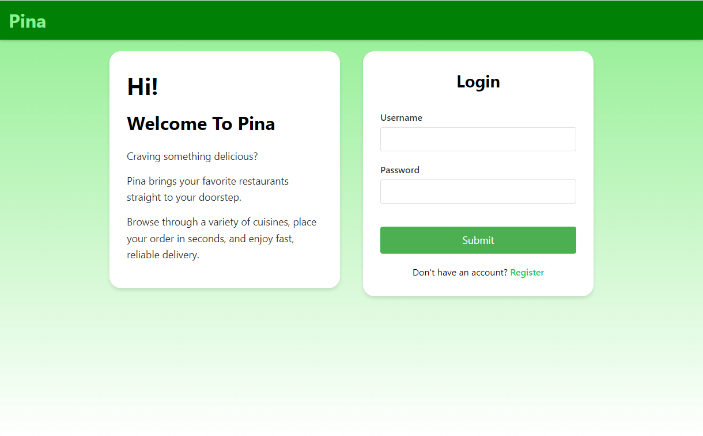

# Pina (FullStack Web App for food delivery)
## run :
-> docker-compose --profile dev up -d  
-> npm install  
-> npm start  

## Example Page :

Full-stack web application for delivering food. 

## System Modules for the App

### Administration Module
- Logs into the system by entering an administrator login ID and password.  
- Manages all user accounts, including customers, restaurants, and couriers.  
- Approves or rejects restaurant and courier registrations.  
- Handles customer complaints and resolves disputes between restaurants, couriers, and customers.  
- Manages platform-wide configurations, such as delivery fee policies and promotions.  
- Ensures data security and compliance with privacy regulations.  
- Can temporarily suspend or permanently ban restaurants or couriers that violate platform policies.  

### Restaurant Module
- Logs into the system by entering restaurant credentials.  
- Adds, updates, and deletes food items from the menu, including prices, descriptions, and availability.  
- Processes incoming customer orders and prepares food for pickup by couriers.  
- Assigns available couriers to deliver completed orders.  
- Views order history and tracks the status of current deliveries.  
- Responds to customer reviews and inquiries to maintain a good reputation.  
- Manages restaurant profile details, including business hours, contact information, and delivery range.  

### Customer Module
- There are two types of customers:  
  - **Non-registered customers** can browse restaurants and food items but cannot place orders.  
  - **Registered customers** have accounts that provide access to order history, saved restaurants, and payment preferences.  
- Searches for restaurants by name, cuisine, or location.  
- Browses food items, selects meals, and adds them to the cart.  
- Leaves ratings and reviews for restaurants and couriers based on service quality.  
- Saves favorite restaurants for quicker access in future orders.  
- Can request refunds or report order issues for resolution by the administrator.  

### Courier Module
- Logs into the system by entering courier credentials.  
- Registers with restaurants to be eligible for delivery assignments.  
- Sets availability status as "Available" or "Unavailable" to receive new delivery requests.  
- Accepts or rejects delivery requests from restaurants.  
- Views assigned orders and navigates to restaurant locations for pickup.  
- Marks orders as "Picked Up" once collected and "Delivered" upon reaching the customer.  
- Tracks earnings, completed deliveries, and ratings received from customers.  
